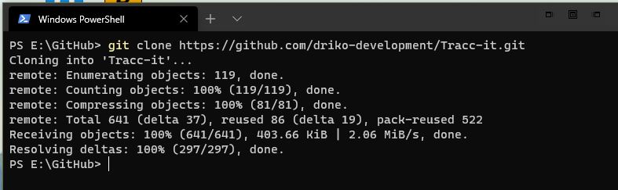
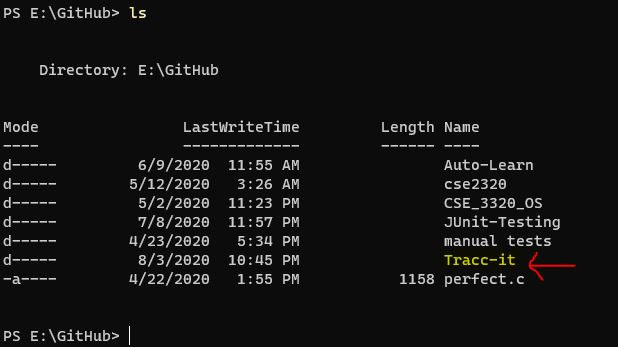
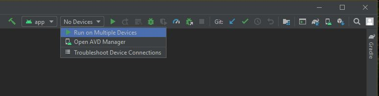
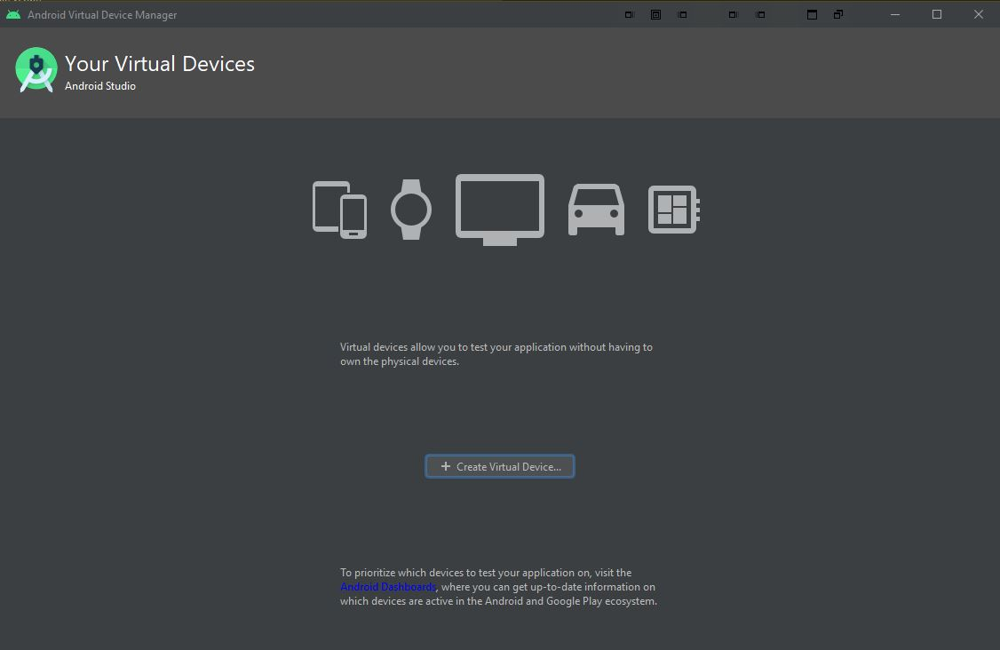
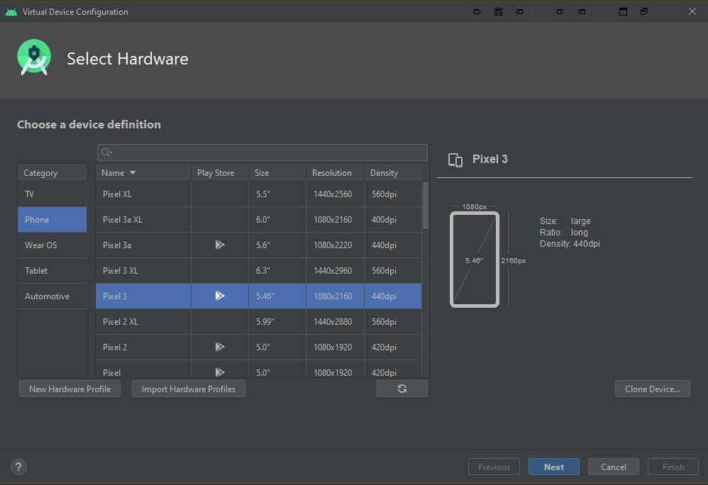
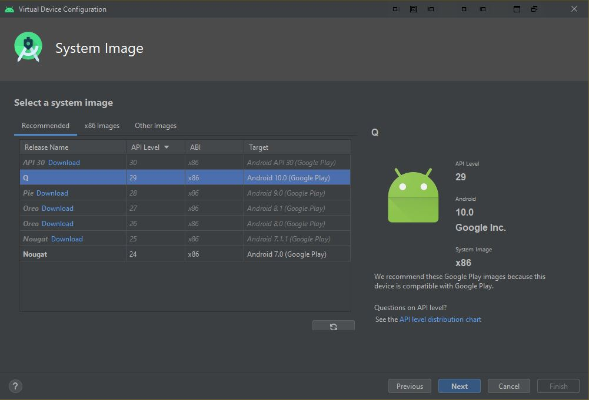
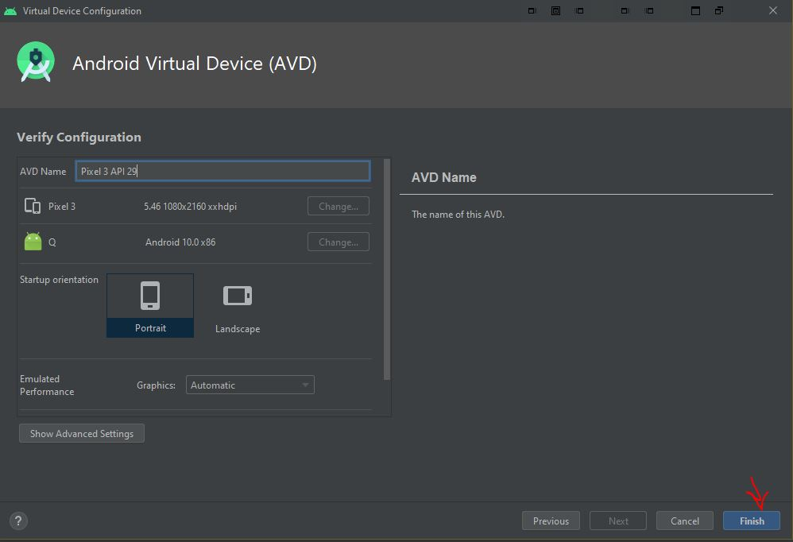
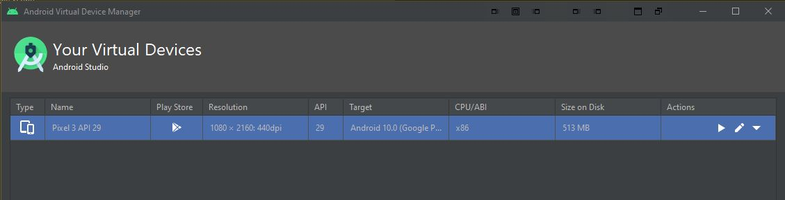

# Tracc-it
Tracc-it is a Personal Health Management System developed using Android Studio

Collaborators to this repository include:

**Jennifer Ulloa (https://github.com/jenniferulloa)**

**Serge Zaatar (https://github.com/Latinz117)** 

**Edrik Aguilera (https://github.com/driko-development)**

**Calvin Mata**

GitHub was used to host our git repository, it contains the following items:

* **Tracc-it-App** - Android studio project
* **Documentation** - Project Documentation
* **README.md** - Project description and instructions

# Tracc-it-App
### Prerequisites
* **Android Studio** must be installed ([Installation Instructions](https://developer.android.com/studio))
* **Git** must be installed ([Installation Instructions](https://git-scm.com/book/en/v2/Getting-Started-Installing-Git))

### Cloning the repository
#### Windows
From the cmd prompt or PowerShell type in the instruction 
**git clone https://github.com/driko-development/Tracc-it.git**
  

Verify that you have the contents of the repository by listing the directory

### Launching the Android Application
1. Launch Android Studio    

2. Select **Open an Existing Android project** and navigate to the directory listed before 

3. Click on the Android project denoted by the green **Android Logo** and hit **OK**    

4. Load an emulated device or connect a device (**Nexus 5x recommended**)  
  

<b>Instructions for Emulated Device</b>

  
  1. From the Android Studio application, up at the top select **No Devices**
  
  
  2. Select **Open AVD Manager**
  
 
  3. From Device Manager select **Create Virtual Device**     
  
  4. Select a device (**Nexus 5X** for testing purposes) and click **Next**
  
  
  5. Choose Android version (**Nougat 7.0 minimum**) and click **Next**
  
  
  6. Keep default settings and press **Finish**
  
  
  7. If the virtual device was created it will be displayed in the Device Manager
  
    

    
